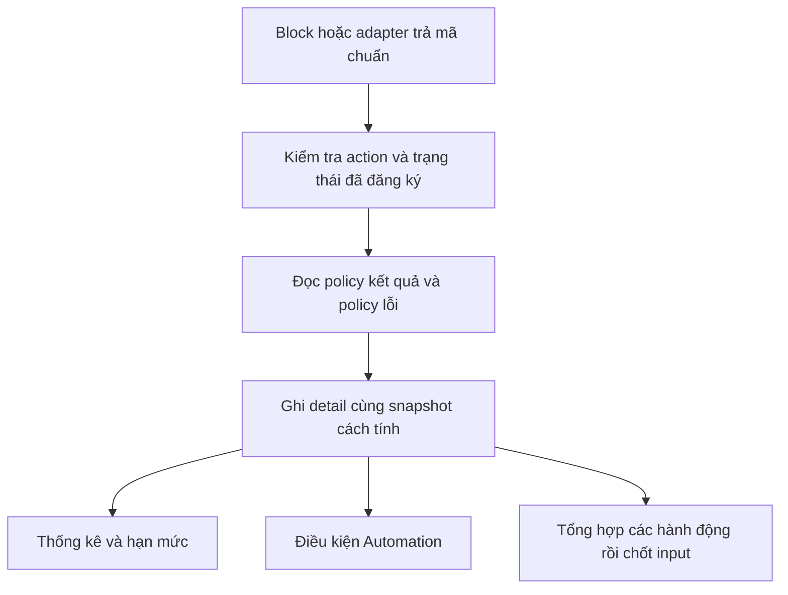

# Rà soát trạng thái và cấu hình xử lý kết quả chiến dịch

Mục tiêu là thêm trạng thái nghiệp vụ hoặc mã lỗi bằng dữ liệu DB, cho block/workflow trả mã đó, rồi runtime ghi nhận, thống kê và xử lý theo cấu hình mà không phát hành lại ứng dụng mỗi lần. Hệ thống hiện có danh mục trạng thái và policy lỗi, nhưng chưa có bộ xử lý chung sử dụng chúng trên toàn bộ luồng. Cần một lần chuyển đổi code/RPC và hợp đồng kết quả trước khi đạt mục tiêu này.

Bản rà soát ngày 09/10/2026 chỉ đọc production `akachat`, ref `cgjbsmqtfhqvttudyjzq`. Không sửa DB, code ứng dụng, block/workflow hay connection/pool. Tài liệu và bằng chứng được lưu trong worktree `codex/fb-email-policy-catalogs`.

## Phạm vi và bằng chứng

- Danh mục live: toàn bộ 38 dòng `auto_status`, 104 policy `auto_error`, 313 mapping `auto_campaign_action_detail_statuses`, 25 hành động `auto_account_actions`.
- Đọc schema/constraint/index/trigger, 82 hàm public tham chiếu trực tiếp các bảng trạng thái/input/detail/policy, 137 block builtin và 33 workflow builtin. Lưu checksum và các dòng liên quan; định nghĩa live là nguồn đối chiếu SQL.
- Đối chiếu source hiện tại của akaAgent, akaAgentWebApp và akaAgentChatApi; lưu commit và checksum từng file. Packaged Server dùng chung `CampaignScheduler` của Desktop; Chat worker có bộ thực thi riêng.
- Phần lịch sử chạy chỉ lấy trạng thái/mã lỗi của 10.000 detail mới nhất qua khóa ID và thống kê planner. Không quét toàn bộ khoảng 4,4 triệu detail và 6,2 triệu input data. Vì detail là text mở, 19 trạng thái trong danh mục không phải bằng chứng rằng toàn bộ lịch sử chỉ có 19 giá trị.
- Source local không chứng minh tất cả máy khách đã chạy phiên bản đó. Không đọc workflow riêng của khách hàng hay dữ liệu người nhận/nội dung tin nhắn.

Bằng chứng: [danh mục DB](audits/status-configuration-20261009/database-catalogs.json), [schema liên quan](audits/status-configuration-20261009/related-schema.json), [hàm và block live](audits/status-configuration-20261009/live-status-consumers.json), [source và checksum](audits/status-configuration-20261009/source-status-consumers.json), [toàn bộ mã và tên](STATUS_CONFIGURATION_INVENTORY_20261009.md).

## Các bảng đang lưu gì

| Bảng | Vai trò hiện tại | Có điều khiển toàn bộ cách xử lý không |
|---|---|---|
| `auto_status` | Tên, mã, component, mô tả, terminal/manual/active và thứ tự của trạng thái chuẩn | Chưa. Source ba repo được quét không đọc trực tiếp bảng này; bốn hàm live có tham chiếu bảng thuộc luồng Automation |
| `auto_campaign_inputs` | Nguồn đầu vào cần tải hoặc tạo data | CHECK cố định 5 trạng thái |
| `auto_campaign_input_data` | Vòng đời xử lý từng data/target | CHECK cố định 4 trạng thái; claim/finalize/recovery còn so chuỗi |
| `auto_campaign_details` | Kết quả từng hành động, mã lỗi, log và dữ liệu; một input có thể có nhiều detail | `status` là text mở; không có `status_id` hay quy tắc thống kê chung; đã có `counts_toward_limit` |
| `auto_campaign_action_detail_statuses` | Danh mục điều kiện Automation theo loại chiến dịch/hành động/trạng thái | Không phải policy đếm; có wildcard và tự đăng ký từ detail |
| `auto_automation_trigger_statuses` | Điều kiện trạng thái đã chọn và lưu của Automation | Runtime so trạng thái/action đã lưu để kích hoạt Automation |
| `auto_error` | Mã nguyên nhân và cấu hình xử lý lỗi | Đã được runtime dùng, nhưng nhận diện lỗi và một số xử lý vẫn nằm trong code |
| `auto_account_error_state`, `auto_campaign_error_state` | Bộ đếm/trạng thái lỗi đang phát sinh | Dữ liệu thực thi, không phải danh mục cấu hình |
| `auto_account_action_status` | Lượt dùng và khóa hành động theo tài khoản | Dữ liệu thực thi, không phải bảng các kết quả của hành động |

### Input và input data

`auto_campaign_inputs`: **chờ xử lý, tạm dừng, đang chạy, hoàn thành, lỗi**. `auto_status.component_type='campaign_input'` đã có đủ 5 dòng.

`auto_campaign_input_data`: **chờ xử lý, tạm dừng, đang chạy, hoàn thành**. `auto_status.component_type='campaign_input_data'` đã có đủ 4 dòng. CHECK đã validated, không cho lưu `lỗi`, `đã là bạn bè` hay `chờ duyệt` trực tiếp vào cột `status` hiện tại.

`hoàn thành` ở input data nghĩa là đã kết thúc xử lý target; hành động có thể thành công, thất bại hoặc lỗi. Scheduler có nhánh ghi input `hoàn thành` kèm note lỗi và lưu kết quả hành động ở detail. Vì vậy không thể dùng số input hoàn thành làm số hành động thành công.

TypeScript `CampaignInputStatus` dùng chung cho hai bảng nên có thêm `lỗi`; đây không phải quyền ghi giá trị đó vào input data. Xem [types.ts](/Users/lequangnhut/Repos/akaAgent/src/shared/types.ts:900) và [finalize input](/Users/lequangnhut/Repos/akaAgent/src/main/services/campaignScheduler.ts:4035).

### Detail

Danh mục chuẩn đang có 19 tên: **Thành công, Thất bại, Lỗi, Đã click, Đã đổi tên, Đã gắn tag, Đã gửi, Đã gửi lời mời, Đã gửi lời mời kết bạn, Đã gửi tin nhắn, Đã là bạn bè, Đã là thành viên, Đã nhận, Đã tham gia, Đã xem, Đang gọi, Không tồn tại, Tag không tồn tại, Tham số không hợp lệ**.

Các tên này không tự xác định nhóm thống kê. Ví dụ `Đã tham gia` đang được dùng cho cả kiểm tra trạng thái sẵn có trong một số luồng. Cần phân biệt kết quả có sẵn và thao tác vừa thực hiện bằng mã riêng khi chúng có cách đếm khác nhau.

Danh mục chưa có `Bỏ qua` chung và `Chờ duyệt tham gia nhóm`. Source Facebook friend đã có nhánh `legacy_skipped` ghi `bỏ qua`; block join group đã trả `requested`, nhưng scheduler chuyển kết quả đó thành `thành công`. Việc chỉ seed thêm tên mới sẽ không đổi các nhánh này.

### Policy lỗi

Có 104 policy: **102 đang bật, 2 đang tắt, 0 xóa mềm**. Hai dòng tắt là `err_zalo_message_stranger_limited` và `err_zalo_duplicate_or_fast_message`; giữ nguyên.

Theo `error_type` hiện lưu: auth 2, business rule 2, system 12, external facebook 39, external zalo 37, external email 12. Đây là phân nhóm của cột hiện tại, không phải thống kê theo tiền tố mã.

`auto_error.detail_status` hiện có NULL hoặc một trong 5 giá trị: `thất bại`, `không tồn tại`, `đã gửi lời mời`, `đã là bạn bè`, `đã là thành viên`. Có 53 dòng NULL. Trong nhánh Zalo, NULL có thể là policy-only, không ghi detail và xử lý dừng/chờ; nhánh Facebook có thể lấy trạng thái fallback. Không được chuyển tất cả NULL thành `lỗi` hoặc một mặc định chung.

Policy có thể đại diện một phản hồi không cần tính thất bại: `err_zalo_already_friend` và `err_zalo_friend_request_sent` là ví dụ. Không suy ra nhóm thống kê chỉ từ việc `error_code` có giá trị.

Các cấu hình đã có: thông báo, trạng thái account/campaign/login, khóa action, ngưỡng lỗi liên tiếp, chế độ khóa `fixed_minutes/end_of_day/indefinite/days_at_time`, `detail_status`, `counts_toward_limit`, `counts_toward_bad_target`. Raw code và action scope hiện chỉ có các cột chuyên Zalo. `error_desc` là mô tả, không được runtime diễn giải thành hành vi.

## Những điểm chưa cấu hình hoàn toàn bằng DB

| Điểm | Hiện trạng và hệ quả | Nguồn |
|---|---|---|
| Kết quả Facebook | Chọn nhánh theo tên block/action rồi tự tạo status/count. Thêm output mới có thể bị gộp, bỏ qua hoặc đi vào fallback | `campaignScheduler.ts`, `logMilestonesV2`, `logFacebookFriendMilestone` |
| Nhận diện lỗi Facebook | `normalizeRuntimeError` xét một số chuỗi thông báo và tên block, thường trả `err_undefined`; chưa nhận mọi `errorCode` của block theo hợp đồng chung | [scheduler](/Users/lequangnhut/Repos/akaAgent/src/main/services/campaignScheduler.ts:9102) |
| Email | Helper tự tạo status/count; catch SMTP ghi thất bại mà không ánh xạ toàn bộ 12 policy mới | [email helper](/Users/lequangnhut/Repos/akaAgent/src/main/services/campaignScheduler.ts:15297) |
| Tổng hợp một target | `recordMilestoneSummary` chỉ nhận `thành công/thất bại/lỗi`, có ngoại lệ theo tên Comment; trạng thái mới không tự tham gia quyết định | [summary](/Users/lequangnhut/Repos/akaAgent/src/main/services/campaignScheduler.ts:9161) |
| Báo cáo Desktop | Thành công: thành công/đã xem/đã click; bỏ qua: đã gửi lời mời/đã là thành viên; nhóm mời Facebook thêm ngoại lệ không tồn tại | [reportRepository](/Users/lequangnhut/Repos/akaAgent/src/main/data/repositories/reportRepository.ts:32) |
| Báo cáo Web | Danh sách thành công còn có đã gửi/đã nhận. Đây là khác biệt cấu hình giữa source hai ứng dụng, cần thống nhất theo hành động | [Web repository](/Users/lequangnhut/Repos/akaAgentWebApp/apps/api/src/modules/aka-agent-control/aka-agent-control.repository.ts:2887) |
| Báo cáo nhóm data và CRM | Hàm live có danh sách status riêng. Có nơi tính `hoàn thành` hoặc `đã tham gia` là thành công | `aka_agent_get_data_group_panel`, `crm_agent_campaign_results`, `crm_trial_campaign_signal_counts`, `fn_opp_trial_state`, `fn_opp_ctx` |
| Tiến độ input | `aka_agent_control_campaign_progress` đếm `input_failed` bằng input_data.status=`lỗi`, nhưng CHECK live cấm giá trị này; với dữ liệu hợp lệ hiện tại số đó bằng 0 | Live MD5 `fdff962116bb5f2c98830dbfaec6a7f4` |
| Hạn mức | Đã ưu tiên `counts_toward_limit`, còn fallback chuỗi cho dòng NULL và logic riêng SMS/voice. Thống kê thành công và tiêu hao hạn mức là hai khái niệm khác nhau | `campaignRepository`, `accountActionRepository`, Web repository, Chat runtime repository |
| Giao diện | Nhãn/màu/lọc còn cố định; Desktop bổ sung status nhìn thấy trong trang detail hiện tại nhưng chưa nạp danh mục đầy đủ từ DB | `CampaignPanel.tsx` |
| Email tracking và SMS | RPC đổi thành công → đã xem → đã click bằng chuỗi; SMS RPC chỉ chấp nhận đã gửi/đã nhận/thất bại | Hàm live `aka_agent_mark_email_open/click`, `aka_agent_record_sms_message_status` |
| Tác dụng phụ | Cooldown, opt-out, engagement và index partial có predicate trạng thái cố định. Đổi riêng báo cáo chưa đủ để đổi các chức năng này | Trigger/index live và `aka_agent_internal_send_delivery_history`, `aka_agent_campaign_engagement_batch` |
| Chat worker | Có executor và bộ áp dụng lỗi riêng; sửa Desktop không tự sửa Server Chat | `zaloCampaignExecutor.ts`, `campaignRuntimeRepository.ts` |

Engine workflow có trạng thái kỹ thuật `pending/running/success/error/skipped`, còn lượt chạy có trạng thái hoàn tất/hủy/lỗi riêng. Chúng điều khiển đồ thị và hủy tác vụ. Trạng thái nghiệp vụ mới phải đi trong output; không thêm tùy ý vào enum kỹ thuật của engine.

## Thiết kế đề xuất

### Một danh mục trạng thái chuẩn

Tiếp tục dùng `auto_status`; không tạo bảng tên trạng thái thứ hai. Dùng `code` hoặc ID ổn định để so khớp, `name` chỉ hiển thị. Giữ component riêng cho input, input data và detail; không lấy trạng thái detail gán trực tiếp vào vòng đời input.

Bổ sung metadata hiển thị khi cần: màu/icon, mô tả điều kiện nhận diện và ý nghĩa. Nếu cho thêm trạng thái con của input data, cần `runtime_class` ánh xạ về bốn lớp chờ/chạy/dừng/xong; label có thể đổi nhưng lớp thực thi vẫn phải rõ ràng. Thêm `status_id` để liên kết danh mục và giữ cột text cũ trong giai đoạn tương thích. Không bỏ CHECK input ngay chỉ để cho phép chuỗi tùy ý.

CHECK `auto_status.flatform_type` hiện chỉ có `all/facebook/zalo`. Có thể dùng `all` với action scope; nếu cần khai báo trạng thái riêng Email/SMS/voice phải mở rộng đúng constraint hoặc liên kết danh mục nền tảng. Không tự gán chúng sang Zalo.

### Policy kết quả theo hành động

Thêm bảng `auto_action_status_policies`, một cấu hình cho mỗi cặp `action_code + status_id`. Trạng thái có sẵn và thao tác mới phải có mã riêng nếu khác cách xử lý. Block mới trả mã chuẩn trực tiếp; output cũ có adapter tương thích, tránh tạo thêm một danh mục tên trùng lặp.

| Nhóm cột đề xuất | Ý nghĩa |
|---|---|
| `id`, `action_code`, `status_id` | Khóa và FK tới hành động/trạng thái, unique cặp hành động/trạng thái |
| `report_bucket` | `success/failure/skipped/pending`; trạng thái cụ thể vẫn giữ nguyên |
| `counts_toward_limit` | Có dùng hạn mức hành động hay không |
| `bad_target_effect` | `increment/reset/ignore`, tránh đồng nhất thất bại báo cáo với dừng chiến dịch và giữ ngoại lệ hành động phụ |
| `input_effect` | Ý định kết thúc, giữ hay tạm dừng data; bộ tổng hợp xét sau các milestone của target |
| `create_detail` | Có tạo kết quả hành động; không ép mỗi step kỹ thuật sinh một detail |
| `is_active`, `description`, `sort_order`, `revision` | Quản lý, mô tả cho agent và xác định cấu hình đã áp dụng |

Đây là schema đề xuất, chưa phải SQL áp dụng. Quyền quản lý là cấu hình hệ thống; block/client không được tự tạo hoặc kích hoạt policy chưa được xác thực. Chưa đặt ngưỡng, timeout hoặc thời gian retry mới.

Không chỉ dựa vào `report_bucket=success` để suy ra thực sự đã gửi, đã kết bạn hay đã tham gia. Các điều kiện cooldown/engagement cần loại sự kiện nghiệp vụ và bằng chứng thực thi riêng. Việc người quản trị chọn đếm “đã là bạn bè” là thành công không được sinh giả một sự kiện vừa gửi lời mời.

### Policy lỗi dùng lại bảng hiện có

Giữ `auto_error` làm nguồn nguyên nhân lỗi, khóa/dừng/thông báo và các ngưỡng hiện có. Khi chuẩn hóa, bổ sung liên kết `detail_status_id` và chế độ ghi detail rõ ràng thay cho việc suy đoán từ NULL; xử lý khác nhau theo action/platform phải được seed thành cấu hình tương thích trước khi chuyển runtime.

Cần định nghĩa thứ tự áp dụng: lỗi chọn policy hợp lệ theo scope; policy xác định trạng thái hiệu lực; policy hành động phân loại trạng thái đó; các override đếm hiện có của policy lỗi được giữ khi chuyển đổi. Một trường phải có thứ tự ưu tiên xác định, không để Desktop và Chat chọn hai nguồn khác nhau. Trạng thái/errorCode mâu thuẫn hoặc chưa được khai báo phải được ghi chẩn đoán và xử lý theo nhánh chưa xác định.

Không bắt buộc thêm bảng raw-error mapping nếu block/workflow đã trả `errorCode` chuẩn. Nếu muốn SMTP/provider raw code cũng quản lý bằng DB, cần bảng mapping chung theo platform/action/mã trả về với thứ tự ưu tiên rõ ràng; không dùng cột `zalo_error_codes`/`zalo_action_codes` cho Facebook hoặc SMTP. Chỉ hỗ trợ các kiểu so khớp đã được engine triển khai, không thực thi JS/SQL tùy ý từ policy.

### Hợp đồng output chung

Ví dụ đề xuất cho một kết quả mới:

```json
{
  "resultVersion": 1,
  "actionCode": "fb_join_group",
  "statusCode": "campaign_detail_group_request_pending",
  "errorCode": null,
  "operationState": "committed",
  "eventKey": "run-unit:input:milestone",
  "message": "Đã gửi yêu cầu tham gia nhóm, đang chờ duyệt"
}
```

`statusCode` tra `auto_status.code`, rồi tra cấu hình theo action. `operationState` mô tả bằng chứng thực thi, tách khỏi nhóm đếm: chưa thực hiện, đã xác nhận hoặc chưa biết kết quả. Giá trị committed chỉ được phát sau khi producer có xác nhận phù hợp. `eventKey` ở ví dụ là ký hiệu; khi triển khai runtime phải ràng buộc nó với run-unit/input/action hợp lệ và chống ghi/đếm lặp. Batch trả kết quả riêng cho từng target; lỗi cấp run không được giả thành kết quả của mọi target.



Như vậy, việc thêm trạng thái mới gồm: thêm `auto_status`; thêm mapping/cách tính của action; nếu có nguyên nhân lỗi thì thêm `auto_error`; sửa block/workflow trả mã chuẩn. Runtime chung không cần thêm `if/switch` cho mã mới.

### Lưu kết quả và giữ lịch sử

`auto_campaign_details` cần tham chiếu trạng thái và policy/revision đã áp dụng, snapshot nhóm thống kê và các quyết định đếm; tái sử dụng `counts_toward_limit` hiện có. Lưu khóa sự kiện hoặc tận dụng khóa chống trùng hiện có sau khi kiểm tra đầy đủ schema của nguồn tạo kết quả. Không để sửa tên hoặc policy hôm nay tự đổi số liệu của mọi lượt chạy trước đó.

Email open/click và SMS delivery cập nhật cùng kết quả là chuyển trạng thái hợp lệ, không phải một lần gửi mới. Phải giữ quota và khóa sự kiện của lần gửi, cập nhật phân loại hiện tại cùng vết chuyển trạng thái. Có thể dùng dữ liệu tracking/journal đã có; chưa kết luận cần thêm bảng sự kiện chung.

`auto_campaign_action_detail_statuses` tiếp tục làm danh mục điều kiện Automation, nhưng phải lấy trạng thái chuẩn từ nguồn chung để tránh nhập lại hai nơi. Giữ ID mapping, điều kiện đã lưu và wildcard hiện hữu khi chuyển đổi. Cơ chế tự phát hiện chỉ ghi nhận trạng thái cần đối chiếu; không tự kích hoạt policy thực thi của mã lạ.

### Vòng đời input vẫn phải bảo toàn thực thi

Một input có thể thực hiện tìm SĐT, gửi tin, gắn tag và đổi tên. Không chốt hoàn thành ngay khi nhận một detail đầu tiên. Tổng hợp kết quả tại ranh giới target/run-unit, giữ khóa/claim/CAS, quyền tenant, hủy tác vụ và tín hiệu đã thực hiện.

Đã gửi một phần, đã thực hiện nhưng mất phản hồi, hoặc không chắc kết quả không được tự đưa về pending chỉ vì policy chọn “bỏ qua”. Retry là hành vi riêng cần điều kiện idempotency và ngân sách đã cấu hình. Trạng thái mới có thể ánh xạ vào cơ chế sẵn có; một cơ chế thực thi hoàn toàn mới vẫn cần bổ sung code.

## Phạm vi thay đổi một lần

1. Chuẩn hóa danh mục và định nghĩa hành vi cũ thành cấu hình, bao gồm những khác biệt giữa các action và runtime. Không sửa policy đang có trong bước chỉ chuẩn bị catalog.
2. Xây bộ giải quyết kết quả chung; adapter cho block cũ và helper native Zalo/SMTP, sau đó chuyển block sang output có phiên bản. Giữ các producer cũ hoạt động khi client chưa nâng cấp.
3. Chuyển scheduler Desktop/packaged Server, Chat worker, ghi detail, quota và quyết định cuối target sang kết quả đã giải quyết. Mã chưa biết không được mặc định thành công hoặc tự retry thao tác chưa rõ kết quả.
4. Chuyển báo cáo Desktop/Web/CRM, màu/nhãn/filter, RPC tổng hợp, Automation, tracking, cooldown và predicate liên quan sang mã/metadata thích hợp. Metadata thống kê không thay thế bằng chứng gửi thực tế.
5. Thêm quản lý cấu hình qua cơ chế admin hiện có nếu cần UI. Nạp catalog theo lô và revision bằng các client/pool đã có, cache theo phiên/run-unit; không query mới cho mỗi recipient hay mở pool/timer riêng.

## Cách triển khai và kiểm chứng

Giai đoạn chuẩn bị DB có thể lưu catalog và policy mới để xem, chưa nối runtime. Điều đó chưa làm cách đếm thay đổi. Không cần apply ngay một migration thay đổi đồng loạt các hàm live để xem danh mục.

Trước mỗi migration cần snapshot/checksum/schema của đúng đối tượng, guard live fail-closed và SQL rollback theo những dòng/cột do migration sở hữu. Chỉ chuyển một nhóm action sau khi có kiểm chứng; giữ đường tương thích và khả năng tắt cơ chế mới. Bản data-only không reload schema; DDL ảnh hưởng metadata API phải theo quy tắc reload của repo. Không thêm connection/pool/index theo thói quen.

Các ca kiểm chứng bắt buộc cho giai đoạn triển khai:

- Thêm một trạng thái giả lập chỉ bằng DB và output fixture; không sửa source sau khi thêm; cả Desktop/Server/Chat/Web hiểu cùng policy.
- Phân biệt đã là bạn/đã gửi trước/vừa gửi, đã là thành viên/vừa tham gia/chờ duyệt, thất bại/lỗi và phản hồi chưa rõ kết quả.
- Policy-only không phát sinh detail/quota ngoài cấu hình; policy NULL legacy giữ đúng hành vi từng platform.
- Nhiều action một target, mixed batch, partial send, hủy sau commit, phát lại event, cập nhật email/SMS không gây gửi lại hoặc đếm hai lần.
- Báo cáo, hạn mức, bad-target và Automation thống nhất nhưng độc lập; sửa label không phá điều kiện đã lưu; sửa policy không âm thầm đổi lịch sử.
- Catalog thiếu/tắt, revision đổi giữa run, old client/new block và new client/old block đều có hành vi xác định.
- Quyền tenant/admin và runtime ownership giữ nguyên; kiểm tra hồi quy theo đúng RPC live, không chỉ dùng migration lịch sử.
- Rollback cấu hình/runtime không xóa lịch sử phát sinh; dừng nếu rollback xóa catalog đang được tham chiếu. Không TRUNCATE, không reset sequence, không phục hồi đè toàn bảng.

Kết quả của đợt này là danh mục và thiết kế để chuẩn bị chuyển đổi. Chưa tạo bảng, thêm cột, sửa policy hoặc apply migration mới.
